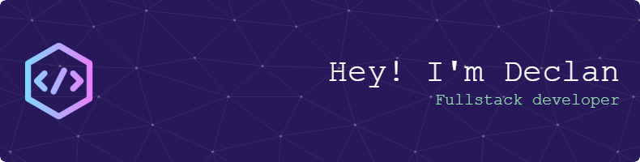
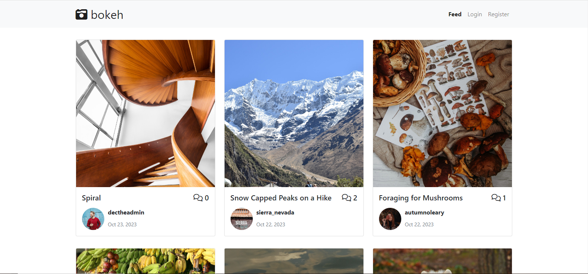
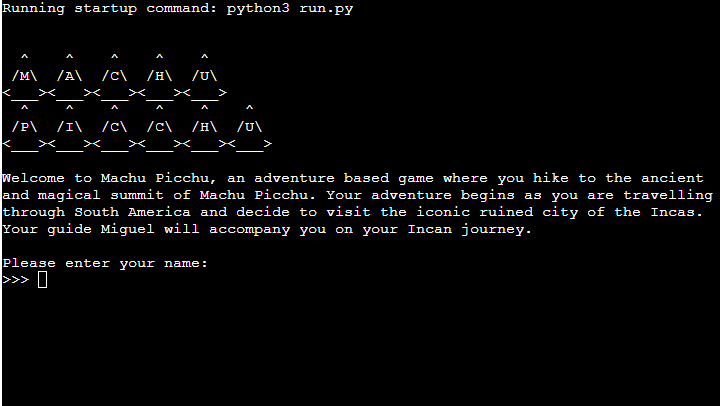
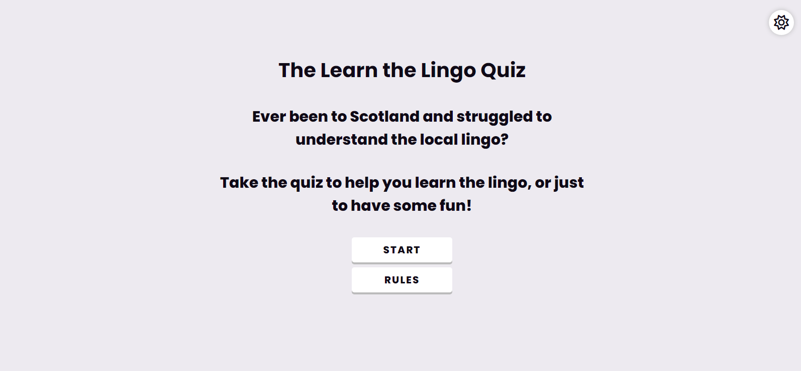
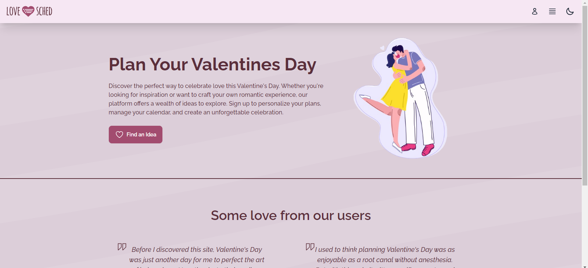
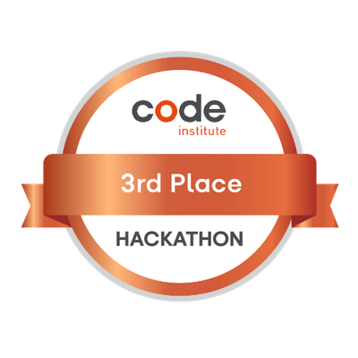

## About Me
I'm a junior full-stack developer with a Diploma in Full Stack specialising in e-ccommerce applications from [Code Institute](https://codeinstitute.net/global/full-stack-software-development-diploma/e-commerce/). You can check out the technologies I've worked with and my portfolio of projects I've created below.
 

### Languages

  
 

### Frameworks & Libraries

 

### Database

 

### Verson Control & Hosting

 
 

## GitHub Stats
|  |  |
| ------------- | ------------- |

## Portfolio
I have worked on projects individually, as well as collaboratively in team-based environments through participating in hackathons. Please feel free to view my body of work below. By clicking on the associated image of each project you can view the repository where there are also links to the live site.
### Personal
#### Reiki

A fully functioning e-commerce web application using a Stripe payment process secured with Stripe Webhooks. The site allows users to view & purchase the products & services provided by the business. Users can create accounts, leave reviews, & contact the business using a contact form. The site also enables administrators to add, edit and remove products, as well as view contact enquiries & pre-approve reviews before they appear on the live site.
 
``Technologies Used`` - HTML5, CSS with Bootstrap, JavaScript, Python, Django, PostgreSQL, Stripe, AWS.
  
#### Bokeh

What is bokeh? A place for photography enthusiasts to upload, share and learn. Engage in conversation and find out how those magic moments were captured.
 
``Technologies Used`` - HTML5, CSS3 with Bootstrap, JavaScript, Python, Django, PostgreSQL
   

#### Machu Picchu Game

An adventure based game played inside a Python terminal and hosted on Heroku. The player uses text input to progress through the various game scenarios.
 
``Technologies Used`` - Python, Heroku
    

#### Learn the Lingo Quiz

Learn the Lingo Quiz is a quiz based learning modality for users to test their knowledge of the local tongue. It is a quiz based game whereby you are presented with a phrase, or term, with four possible answers to choose from. It is aimed at people who are interested in the fun of linguistics and want to learn the local lingo.
 
``Technologies Used`` - Javascript, HTML5, CSS3
  

#### Beach Yoga Fuerteventura

Beach Yoga Fuerteventura is a website designed for a fictional yoga club in El Cotillo, Fuerteventura. The website is designed for the client and also for the user. Its purpose is to provide information about yoga and the club. It is aimed at people who are interested in yoga and who are living in or visiting the area. It also provides an area to request more information if desired.
 
``Technologies Used`` - HTML5, CSS3
  

### Collaborative
#### LoveSched - Cupid's Code Quest Hackathon by Code Institute - 3rd Place

Welcome to LoveSched. An events-ideas and date planner for all your romantic needs. Whether they're in a couple, or single-and-ready-to-mingle, users can browse a gallery to view dating event ideas. For additional     features, users can create a profile account. With their own account, they can save their favourite events, schedule events into their own personal calendar, and even create new, custom events! Custom events can even be published to Love Sched for other users to view and save.
 
``Technologies Used`` - HTML5, CSS3 with Tailwind, JavaScript, Python, Django, PostgreSQL
 

  
